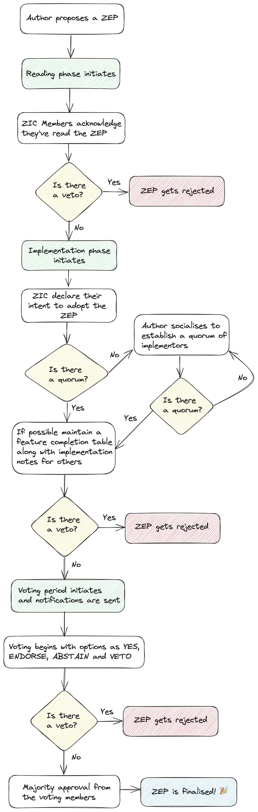

# ZEP 0 — Purpose and process

Author: Sanket Verma [(@msankeys963)](https://github.com/msankeys963), Zarr

Email address: <svsanketverma5@gmail.com>

Status: Active

Type: Process

Created: 2022-03-14

Discussion #1: <https://github.com/zarr-developers/governance/pull/16>

Revised on: 2024-10-15

Discussion #2: <https://github.com/zarr-developers/zeps/pull/59>

## What is ZEP?

ZEP stands for Zarr Enhancement Proposal. A ZEP is a design document providing
information to the Zarr community, describing a modification or enhancement of
the Zarr specification, a new feature for its processes or environment.
The ZEP should provide specific proposed changes to the Zarr specification and
a narrative rationale for the specification changes.

We intend ZEPs to be the primary mechanism for evolving the spec, collecting
community input on major issues and documenting the design decision that has
gone into Zarr. In addition, the ZEP author is responsible for building
consensus within the community and documenting dissenting opinions.

Because the ZEPs are maintained as text files in a versioned repository, their
revision history is the historical record of the feature proposal.

WHERE:

- Developers refer to contributors and maintainers of the project
- User(s) refers to an individual or group of individuals or the broader
community using the project in any way.

## ZEP audience

<!-- Mention Zarr-Spec devs in line: 57-59, after zarr-developers/governance/#44 is finalised -->

The typical primary audience for ZEPs is the developers working on Zarr and its
various implementations, the Zarr steering council as well as the Zarr
community.

The broader Zarr community may also choose to use the process to document
expected feature additions and to manage complex design coordination problems
that require collaboration across multiple projects.

## ZEP types

- **Core ZEP**

<!-- Mention Zarr-Spec devs in line: 71-81, after zarr-developers/governance/#44 is finalised -->

Describes a ZEP which involves changes in the core specification of Zarr. Core
ZEPs apply to [Zarr Specifications] and its various implementations under the
[zarr.dev/implementations]. The core ZEPs should be adopted by every
implementation of Zarr and, in general, the overall Zarr community. Core ZEPs
must go through a thorough review process, including involvement, discussion,
and voting from the author of the proposed ZEP, Zarr Steering Council, author
(s) of various Zarr implementations (ZIC), and open-source projects/research
groups using Zarr and the general Zarr community. The general advice is that
everyone should be made aware of changes introduced by core ZEPs. Core ZEPs
require community consensus, and developers or users are typically not free to
ignore them.

Since core ZEPs are reviewed, adopted and implemented by the majority of the Zarr community — every accepted and approved one will result in a major version increment of the Zarr specification.

<!-- Removing Extension ZEPs — we're working to find a new way to add extensions. See zarr-developers/zarr-specs/#312 -->

- **Informational ZEP**

Describes a ZEP design issue or provides general guidelines or information to
the Zarr community but does not propose a new feature. Informational ZEPs do
not necessarily represent Zarr community consensus or recommendation, so users
and implementers are free to ignore informational ZEPS or follow their advice.

- **Process ZEP**

Describes a new process around Zarr and its implementations or proposes a
change to (or an event in) a process. They may propose an implementation, but
not to the Zarr’s specification or its implementations; they require community
consensus; unlike informational ZEPs, they are more than recommendations, and 
developers or users are typically not free to ignore them. Examples include 
procedures, guidelines, changes to the decision-making process, and changes to
the tools or environment used in Zarr’s specification development. Any meta-ZEP
is also considered a Process ZEP.

## ZEP Workflow

The ZEP process begins with a new idea for Zarr. It is highly recommended that a
single ZEP contain a single key proposal or new idea. Small enhancements or
patches often don’t need a ZEP and can be injected into the Zarr development
workflow with a pull request to the [zarr-specs] repo. The more focused the
ZEP, the more successful it tends to be. If in doubt, split your ZEP into
several well-focused ones.

Each ZEP must have a champion -- someone who writes the ZEP using the style and
format described below, shepherds the discussions in the appropriate forums,
and attempts to build community consensus around the idea. The ZEP champion
(a.k.a. Author) should first attempt to ascertain whether the idea is suitable
for a ZEP.

**Creating an issue in the [zarr-specs] repository, asking around during the
[ZEPs meetings], and posting to [Zulip] are the best ways to do this.**

The ZEP champion is the lead author of the ZEP. A ZEP should have a lead
author and can have multiple co-author(s).

Vetting an idea publicly before going as far as writing a ZEP is meant to save
the potential author time. Asking the Zarr community first if an idea is
original helps prevent too much time being spent on something that is
guaranteed to be rejected based on prior discussion. It also helps to make sure
the idea applies to the entire community and not just the author. Just because
an idea sounds good to the author does not mean it will work for most people.

Once the champion has asked the Zarr community whether an idea has any chance
of acceptance, a draft ZEP should be presented to the appropriate venue
mentioned below. This allows the author to flesh out the draft ZEP to make it
properly formatted, of high quality, and address initial concerns about the
proposal.

## Submitting a ZEP

### For Core ZEPs

The proposal should be submitted as a draft ZEP via a GitHub pull
request to the [zarr-specs] repository.

The PR should contain the narrative document explaining the need, importance,
and use case for the change of the ZEP and should be submitted in the
zarr-specs repository with the name `zep-<n>: <title>.md` under
[/zarr-specs/docs/zeps/draft], where `<n>` is an appropriately assigned
four-digit number. The draft ZEP must use the [ZEP X - Template and
Instructions][template.md] file.

The Core ZEPs PR should also contain actual changes to the specification under
[/zarr-specs/docs/specs/...] and mention the assigned four-digit ZEP number
from the ZEP document.

It is also highly recommended that the PR should accompany a complete
implementation or at least an implementation PR in one of the repositories
represented at [zarr.dev/implementations].

### For Informational and Process ZEPs

The proposal should be submitted as a draft ZEP via a GitHub pull request to
the [zarr-specs] repository with the name `zep-<n>: <title>.md` where `<n>` is
an appropriately assigned four-digit number (e.g., zep-0000.md). The draft ZEP
must use the [ZEP X - Template and Instructions][template.md] file.

A few points to consider while submitting your ZEP:

- It should sound complete. The ideas must make technical sense.
- The title should accurately describe the content.
- The ZEP’s language (spelling, grammar, sentence structure etc.) and code style should be correct and conformant.

<!-- Mention Zarr-Spec devs in line: 176-180, after zarr-developers/governance/#44 is finalised -->

The [Zarr Steering Council] and the [Zarr Implementations Council] will not
unreasonably deny publication of a ZEP. Reasons for denying ZEP include
duplication of effort, being technically unsound, not providing proper
motivation or addressing backwards compatibility, or not taking care of Zarr
[CODE OF CONDUCT].

## Discussing a ZEP

As soon as the draft ZEP is committed to the [zarr-specs] repository, the author
(s) should use the submitted PR for the ZEP as a central place to discuss and
review its contents. The ZEP author(s) may create additional issues in the
[zarr-specs] repository if the discussion gets long, complicated and hard to
follow in the submitted PR. The separate issue(s) may provide a place for
focused discussion on various portions of the draft ZEP.

In all cases, the author(s) should add the link of the additional issues created
to the PR description and the `Discussion` section of the ZEP.

The discussion regarding the ZEP should follow Zarr’s [CODE OF CONDUCT] at all
times.

ZEP authors are responsible for collecting community feedback on a ZEP.
However, to avoid long-winded and open-ended discussions, strategies such as
soliciting private or more narrowly-tailored feedback in the early design
phase, collaborating with other community members with expertise in the ZEP’s
subject matter, and picking appropriately-specialised discussion for the ZEP’s
topic should be considered. ZEP authors should use their discretion here.

Once the ZEP PR is committed to the [zarr-specs] repository, substantive issues
should generally be discussed on the canonical public thread instead of private
channels or unrelated venues. This ensures everyone can follow and contribute,
avoids fragmenting the discussion, and ensures it is entirely considered part
of the ZEP review process. Comments, support, concerns, and feedback on this
designated thread are critical when reviewing the ZEP.

## Review and Resolution

The possible paths of the status of ZEPs are as follows:


All ZEPs should be created with the `Draft` status.

Eventually, after the discussion, there may be a consensus that the ZEP should
be accepted. At this point, the status becomes `Accepted`.

To allow the gathering of additional design and interface feedback before
committing to long term stability for specification change or standard library
API, ZEP may also be marked as `“Provisional”`. This is short for
“Provisionally Accepted” and indicates that the proposal has been accepted for
inclusion in the reference implementation or storage specification, but
additional user feedback is needed before the full design can be considered
`“Final”`. Unlike regular accepted ZEPs, provisionally accepted ZEPs may still be
Rejected or Withdrawn even after the related changes have been included in a
Zarr release.

Wherever possible, it is considered preferable to reduce the scope of a
proposal to avoid the need to rely on the `“Provisional”` status (e.g. by
deferring some features to later ZEPs), as this status can lead to version
compatibility challenges in the wider Zarr ecosystem.

<!-- Mention Zarr-Spec devs in line: 239-241, after zarr-developers/governance/#44 is finalised -->

A ZEP can also be assigned status `Deferred`. The ZEP author or [Zarr Steering
Council] or Zarr Implementations Council can assign the ZEP this status when no
progress is being made on the ZEP.

A ZEP can also be `Rejected`. Perhaps, after all, is said and done it was not a
good idea. It is still important to have a record of this fact. The `Withdrawn`
status is similar—it means that the ZEP author themselves has decided that the
ZEP is a bad idea, or has accepted that a competing proposal is a better
alternative.

When a ZEP is `Accepted`, `Rejected`, or `Withdrawn`, the ZEP should be updated
accordingly. In addition to updating the status field, at the very least the
`Resolution` header should be added with a link to the relevant link of the
discussion.

ZEPs can also be `Superseded` by a different ZEP, rendering the original
obsolete. The `Replaced-By` and `Replaces` headers should be added to the
original and new ZEPs respectively. Process ZEPs may also have a status of
`Active` if they are never meant to be completed, e.g. ZEP 0 (this ZEP).

## How does a ZEP become accepted?

<!-- Mention Zarr-Spec devs in line: 263-267, after zarr-developers/governance/#44 is finalised -->

The Zarr Enhancement Proposal (ZEP) undergoes a systematic process to ensure its
successful adoption by software implementations governed by the Zarr
Implementation Council (ZIC). This process guarantees the stability of the
specification, fosters community consensus, and maintains a high standard of
agreement among maintainers.

### Reading Phase

The Reading Phase, or Request for Comments (RFC) phase, initiates the ZEP
proposal process, marking the introduction of the proposal to the Zarr
community.

1. **Stakeholder Engagement**:
    - During this phase, stakeholders actively participate by expressing
      concerns and opinions related to the proposal.
    - The author uses the submitted PR or establishes a separate GitHub issue to
      facilitate discussions, addressing questions, doubts, and concerns.

2. **Duration Definition**:
    - The author communicates the duration of the Reading Phase when submitting
      the ZEP, typically ranging from a suggested 3-4 weeks with flexibility
      for exceptional circumstances.

3. **Feedback Collection**:
    - Authors anticipate and welcome suggestions from readers to enhance the
      proposal, encouraging general comments to refine definitions, add URLs,
      or improve overall readability.

4. **ZIC Acknowledgment**:
    - ZIC members publicly acknowledge their engagement during the Reading
      Phase, ensuring a comprehensive understanding of community involvement.

<!-- Mention Zarr-Spec devs in line: 297-300, after zarr-developers/governance/#44 is finalised -->

5. **VETO Mechanism**:
    - A VETO option is available to ZIC members if the proposal introduces
      potential breaking changes to existing software implementations, serving
      as a precautionary measure.

Authors may utilize the submitted pull request (PR) for gathering comments,
feedback, acknowledgment, and facilitating engagement from ZIC members during
the Reading Phase.

### Implementation Phase

The Implementation Phase encompasses the timeline during which interested
adopters actively work on integrating the proposal into their
codebases.

1. **Declaration of Intent**:
    - Before committing to implementation, ZIC members declare their intention
      to adopt the proposal, contributing to the formation of a cohesive
      adopter quorum; requiring the participation of a minimum of two ZIC members.

2. **Reference Implementation**:
    - The author provides a reference implementation upon ZEP submission, a
      crucial resource during the implementation phase.
    - The inclusion of an Implementation Notes section in the ZEP proposal
      further assists ZIC members in understanding the implementation nuances.

3. **Collaborative Iteration**:
    - Implementors are expected to actively engage by raising issues, providing
      constructive suggestions, and highlighting areas for improvement in the
      ZEP proposal.

4. **Feature Completion Table**:
    - For proposals with divisible implementation details, maintaining a
      real-time Feature Completion Table ensures effective coordination among
      the Zarr community and stakeholders.

<!-- Mention Zarr-Spec devs in line: 335-343, after zarr-developers/governance/#44 is finalised -->

5. **Veto Consideration**:

    - ZIC members hold the authority to veto the proposal if they identify
      potential issues with its implementation in their software environments.
      A veto signals the need to resolve these concerns before proceeding,
      indicating that the ZEP proposal may not advance further until the
      underlying issues are clarified.
    - Should the author encounter challenges in addressing the vetoed concerns,
      the ZEP proposal may be subject to rejection at this stage.

5. **Concluding Implementation Phase**:

    - Upon the completion of a majority of implementations within the
      established quorum and the absence of any vetoes, the ZEP may be
      designated as `Accepted` or `Provisional` following consensus among ZIC
      members and the broader Zarr community.

These designations signify the successful integration and adoption of the
proposal into the Zarr ecosystem, reflecting its alignment with existing
implementations and consensus-driven acceptance.

The author may utilize the submitted pull request (PR) or create an additional
issue in the zarr-specs repository to gather implementation notes from the
established quorum.

### Voting Phase

<!-- Mention Zarr-Spec devs in line: 364-369, after zarr-developers/governance/#44 is finalised — who'll participate in the voting process? -->

The Voting Phase represents the final stage where the ZIC and Zarr Steering
Council (ZSC) formally vote on the ZEP proposal.

1. **Notification**:
    - ZIC and ZSC members receive formal notification of the initiation of the Voting Phase.

2. **Casting Votes**:
    - During the vote, ZIC and ZSC members cast their votes as `YES`, `ENDORSE`,
      `ABSTAIN`, or `VETO` providing clarity on their stance.

3. **Vote Definitions**:
    - `YES` indicates the member has implemented the ZEP and has no objection to
      the proposal.
    - `ENDORSE` signifies a commitment to future implementation, with no
      objections to the proposal.
    - `ABSTAIN` indicates a member's decision not to implement the ZEP but
      expresses no objection to its proposal.
    - `VETO` Allows a member to exercise veto power if they think the proposal
      still introduces potential breaking changes to existing software
      implementations, serving as a precautionary measure.

4. **Outcome Determination**:
    - In the event of a VETO, the proposal undergoes further discussion and
      potential revisions to address concerns raised before proceeding.
    - If the author and stakeholders are not able to resolve the concerns
      regarding the proposal, the ZEP may be rejected due to lack of sufficient
      support or consensus.

5. **Majority Approval**:
    - If the proposal receives a majority of `YES` and `ENDORSE` votes and no
      vetoes, it proceeds to the finalization stage.

6. **Finalization**:
    - The Voting Phase concludes upon achieving a majority of approval from
      voting members and resolving any pending comments or feedback.
    - After this phase, the ZEP proposal attains a `Final` status, and no
      further changes are permitted, ensuring a stable and conclusive outcome.

The author may utilize the submitted pull request (PR) or create an additional
issue in the zarr-specs repository to facilitate the voting phase.

Here's a flowchart for enhanced visual understanding of the different phases:



These phases are integral for ZEPs entailing substantial specification changes,
such as the incrementation of major versions (e.g., V3 → V4) or addition of new
extensions.

Authors are also encouraged to adapt or incorporate elements of these phases for
use in Informational and Process ZEPs, as deemed appropriate.

**Upon reaching Final status**, the corresponding pull request for the Core ZEP
  in the [zarr-specs] repository must be merged.

**Similarly, for finalised Informational or Process ZEPs**, the associated pull
request in the [zarr-specs] repository must be merged. Following this, authors
should promptly enact any procedural, guideline, or decision-making process
changes as necessary.

Upon finalizing a ZEP, the author is responsible for:

- Updating the status from `Draft` to `Accepted`/`Final` and including the link for
  the voting issue if applicable.
- Adding the date of acceptance in the ZEP header.
- Relocating the ZEP from [/zarr-specs/docs/zeps/draft] to
  [/zarr-specs/docs/zeps/accepted or final].
- Removing the `DRAFT` watermark from the background if present.

<!-- Mention Zarr-Spec devs in line: 435-442, after zarr-developers/governance/#44 is finalised -->

The [Zarr Steering Council] (ZSC) and [Zarr Implementations Council](ZIC) closely
review the submitted ZEPs, while the author(s) should simultaneously engage the
community in their ZEP discussion. The ZSC and ZIC will consider community
consensus when making the final decision on ZEPs. Author(s) should ensure that
the involvement and discussion form the consensus on the ZEP from the author of
various Zarr implementations, open-source projects/research groups using Zarr,
the general Zarr community, and anyone else they think should be included in
the discussions.

## Maintenance

In general, ZEPs are no longer modified after they have reached the `Final`
state. The changes made to the Zarr’s specification in the
[zarr-specs] repository are considered the ultimate reference.

However, finalised ZEPs may undergo minor updates as necessary, with adherence
to semantic versioning principles.

Process ZEPs may be updated over time to reflect changes to development
practices and other details. The precise process followed in these cases will
depend on the nature and purpose of the ZEP being updated.

## ZEP Format

ZEPs are UTF-8 encoded text files using the [reStructuredText] format.
Please see the [ZEP X - Template and Instructions][template.md] file and the
[reStructuredTextPrimer] for more information.

## Header Preamble

```
Author: <list of authors’ real names and email addresses>
Status: < Draft | Active | Accepted | Deferred | Rejected | Withdrawn | Final | Superseded >
Type: <Core | Process | Informational>
Created: <date created on, in yyyy-mm-dd format>
Require: <Previous ZEP number>
Replaces: <ZEP number>
Replaced-By: <ZEP number>
Discussion:  <Link to discussion thread>
```

The Author header lists the names and the email addresses of all the authors of
the ZEP. The format of the Author header value must be:

```
Random J. User <address@dom.ain>
```

## Discussion

#1: <https://github.com/zarr-developers/governance/pull/16>

#2: <https://github.com/zarr-developers/zeps/pull/59>

## Copyright

This document has been placed in the public domain.


<!-- External links -->
[Zulip]: https://ossci.zulipchat.com/
[Zarr Specifications]: https://zarr-specs.readthedocs.io/
[reStructuredText]: http://docutils.sourceforge.net/rst.html
[reStructuredTextPrimer]: https://www.sphinx-doc.org/en/master/usage/restructuredtext/basics.html
[template.md]: https://zarr.dev/zeps/template/template.html
[ZEPs meetings]: https://zarr.dev/zeps/meetings/

<!-- governance specific links -->
[CODE OF CONDUCT]: https://github.com/zarr-developers/.github/blob/main/CODE_OF_CONDUCT.md
[Zarr Steering Council]: https://github.com/zarr-developers/governance/blob/main/GOVERNANCE.md#zarr-steering-council
[Zarr Implementations Council]: https://zarr.dev/zeps/zic/

<!-- github links: capitalization matches that of the repo -->
[community]: https://github.com/zarr-developers/community
[discussions]: https://github.com/orgs/zarr-developers/discussions
[zarr.dev/implementations]: https://zarr.dev/implementations
[zarr-developers/zarr_implementations]: https://github.com/zarr-developers/zarr_implementations
[zarr-specs]: https://github.com/zarr-developers/zarr-specs
[ZEPs]: https://github.com/zarr-developers/zeps
[zarr-developers/zeps]: https://github.com/zarr-developers/zeps
[/zeps/draft/]: https://github.com/zarr-developers/zeps/tree/main/draft